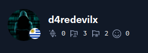

<!--
**d4redevilx/d4redevilx** is a ✨ _special_ ✨ repository because its `README.md` (this file) appears on your GitHub profile.

Here are some ideas to get you started:

- 🔭 I’m currently working on ...
- 🌱 I’m currently learning ...
- 👯 I’m looking to collaborate on ...
- 🤔 I’m looking for help with ...
- 💬 Ask me about ...
- 📫 How to reach me: ...
- 😄 Pronouns: ...
- ⚡ Fun fact: ...
-->

  <h1>Hello I'm d4redevilx</h1>

  <h3>Pentester in progress | Red Team | Web Developer | GNULinux | CTF Player On Hack The Box</h3> 
  <h4>My Hack The Box Profile</h4>
  

  
  
  
  
  

<body>
</html>
